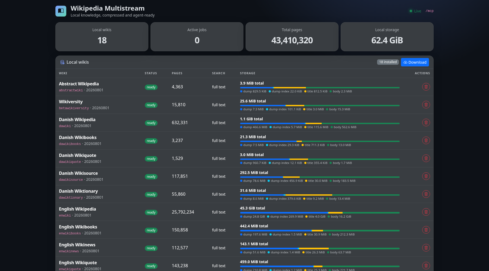

# wikipedia-multistream-mcp

A local-first MCP server for downloading, indexing, searching, and reading
[Wikimedia multistream dumps](https://meta.wikimedia.org/wiki/Data_dumps/Dump_format#Multistream_dumps).
Large page bodies stay in Wikimedia's compressed bzip2 files. A compact title
index is published first, so title search and page reads become available while
the full-text body index continues building in the background.



## Build and run

Go 1.25 or newer is required.

Daily rolling releases provide binaries and SHA-256 checksums for Linux,
macOS, and Windows on AMD64 and ARM64. The workflow skips days without code
changes and can also be run or repaired manually from GitHub Actions.

```sh
go build -o wikipedia-multistream-mcp .
./wikipedia-multistream-mcp serve
```

The backend listens on `http://127.0.0.1:8765/mcp` and stores runtime data in
`./data`. Both can be changed:

```sh
./wikipedia-multistream-mcp serve --listen 127.0.0.1:9000 --data-dir /srv/wiki-data
```

Downloads and indexing use independent worker pools, so indexing one wiki does
not block downloads of others. The defaults allow three download/update jobs
and two indexing jobs at once; tune them with `--download-workers` and
`--index-workers`. Files of at least 64 MiB use up to three parallel HTTP ranges,
shared globally across active downloads; tune that limit independently with
`--download-connections`. HTTP 429/503 responses back off and keep retrying for
the lifetime of the job. Range progress is persisted beside the staging file
and safely resumes after restarts.

The listener is intentionally restricted to an explicit loopback IP. There is
no authentication layer.

Open `http://127.0.0.1:8765/` for the lightweight local dashboard. It shows
downloaded wikis, available upgrades, current/recent job progress, and aggregate
page/storage statistics. A Download button opens the complete Wikimedia dump
catalog in a searchable modal, including human-readable project, language, and
content-purpose metadata. The modal can filter by language and hide already
installed wikis. The backend caches the complete catalog for one day
and searches that local copy. Upgrade controls appear with the other local-wiki
actions. A confirmed trash action permanently removes an idle local wiki and
its staged remnants; active work must be canceled first.
Alpine.js receives live local and job snapshots over a WebSocket; Bootstrap,
Bootstrap Icons, and Alpine.js are pinned and embedded in the binary, with no
CDN dependency.
Progress persistence and WebSocket snapshots are coalesced to at most twice per
second, and directory-size scans use a short cache, so an open dashboard does
not generate continuous metadata I/O while an index is being built.

The job table has live Running, Queued, Failed, and Completed filters. Rows use
a stable submission order while active, rather than moving whenever progress is
reported.

## CLI

All commands below talk to the already-running backend and return after one MCP
request. Download and update jobs continue in the backend and must be polled.

```sh
# Browse completed online multistream dumps.
./wikipedia-multistream-mcp wiki available dawiki

# Submit a first download; the JSON response contains the job ID.
./wikipedia-multistream-mcp wiki download dawiki

# Poll once by ID or by wiki. Repeat from your shell as needed.
./wikipedia-multistream-mcp wiki status JOB_ID
./wikipedia-multistream-mcp wiki status --wiki dawiki

# Control a job without losing its staged files.
./wikipedia-multistream-mcp wiki job JOB_ID --action pause
./wikipedia-multistream-mcp wiki job JOB_ID --action resume
./wikipedia-multistream-mcp wiki job JOB_ID --action cancel
./wikipedia-multistream-mcp wiki job JOB_ID --action retry

# List installed datasets and their title/full-text readiness.
./wikipedia-multistream-mcp wiki list

# Submit an update check for an installed wiki.
./wikipedia-multistream-mcp wiki update dawiki

./wikipedia-multistream-mcp search dawiki "Copenhagen architecture"
./wikipedia-multistream-mcp search dawiki "Copenhagen architecture" --include-non-articles
./wikipedia-multistream-mcp read dawiki "København"
./wikipedia-multistream-mcp read dawiki "København" --outline
./wikipedia-multistream-mcp read dawiki "København" --section History
./wikipedia-multistream-mcp read dawiki --page-id 12345 --format wikitext
```

Set `WIKIPEDIA_MULTISTREAM_MCP_SERVER` or pass `--server` when the backend uses
a non-default loopback port.

## MCP clients

Clients supporting Streamable HTTP can connect directly to:

```text
http://127.0.0.1:8765/mcp
```

For clients that only support stdio, configure this command after starting the
backend:

```sh
/absolute/path/wikipedia-multistream-mcp mcp stdio
```

## User service

The included systemd user unit uses standard per-user application and data
directories:

```sh
mkdir -p ~/.local/lib/wikipedia-multistream-mcp \
  ~/.local/share/wikipedia-multistream-mcp/data \
  ~/.config/systemd/user
go build -o ~/.local/lib/wikipedia-multistream-mcp/wikipedia-multistream-mcp .
cp contrib/systemd/wikipedia-multistream-mcp.service ~/.config/systemd/user/
systemctl --user daemon-reload
systemctl --user enable --now wikipedia-multistream-mcp.service
```

Inspect it with `systemctl --user status wikipedia-multistream-mcp.service` or
`journalctl --user -u wikipedia-multistream-mcp.service`. Runtime wiki data
is stored under `~/.local/share/wikipedia-multistream-mcp/data`.

## Agent installation

An AI coding agent can perform a verified Linux installation without building
from source. The following commands support AMD64 and ARM64 systems with a
systemd user session and require `curl`, `jq`, and `sha256sum`. They download
the latest rolling release, verify its published SHA-256 checksum, install the
user service, and perform an MCP call:

```sh
set -euo pipefail

case "$(uname -m)" in
  x86_64) release_arch="amd64" ;;
  aarch64|arm64) release_arch="arm64" ;;
  *) echo "Unsupported architecture: $(uname -m)" >&2; exit 1 ;;
esac

release_repo="lkarlslund/wikipedia-multistream-mcp"
release_tag="$(curl -fsSL "https://api.github.com/repos/${release_repo}/releases/latest" | jq -r .tag_name)"
release_asset="wikipedia-multistream-mcp-${release_tag}-linux-${release_arch}"
install_tmp="$(mktemp -d)"
trap 'rm -rf -- "$install_tmp"' EXIT

curl -fL "https://github.com/${release_repo}/releases/download/${release_tag}/${release_asset}" \
  -o "${install_tmp}/${release_asset}"
curl -fL "https://github.com/${release_repo}/releases/download/${release_tag}/${release_asset}.sha256" \
  -o "${install_tmp}/${release_asset}.sha256"
(cd "$install_tmp" && sha256sum -c "${release_asset}.sha256")

install -d "$HOME/.local/lib/wikipedia-multistream-mcp" \
  "$HOME/.local/share/wikipedia-multistream-mcp/data" \
  "$HOME/.config/systemd/user"
install -m 0755 "${install_tmp}/${release_asset}" \
  "$HOME/.local/lib/wikipedia-multistream-mcp/wikipedia-multistream-mcp"
curl -fsSL "https://raw.githubusercontent.com/${release_repo}/${release_tag}/contrib/systemd/wikipedia-multistream-mcp.service" \
  -o "${install_tmp}/wikipedia-multistream-mcp.service"
install -m 0644 "${install_tmp}/wikipedia-multistream-mcp.service" \
  "$HOME/.config/systemd/user/wikipedia-multistream-mcp.service"

systemctl --user daemon-reload
systemctl --user enable --now wikipedia-multistream-mcp.service
curl --retry 10 --retry-delay 1 --retry-connrefused -fsS \
  http://127.0.0.1:8765/healthz
"$HOME/.local/lib/wikipedia-multistream-mcp/wikipedia-multistream-mcp" wiki list
```

The agent should then register the Streamable HTTP MCP endpoint exactly as
`http://127.0.0.1:8765/mcp`. The dashboard URL is
`http://127.0.0.1:8765/`; it is not the MCP endpoint. Clients that only support
stdio should run
`~/.local/lib/wikipedia-multistream-mcp/wikipedia-multistream-mcp mcp stdio`
after the service is active.

On macOS or Windows, download the matching release asset and run
`wikipedia-multistream-mcp serve`; persistent service registration is
platform-specific.

The server offers these action-specific tools:

| Tool | Purpose |
| --- | --- |
| `wiki_list_available` | Filter and paginate online multistream dumps. |
| `wiki_list_local` | List installed wikis using agent-oriented project, language, content scope, source URL, article/page count, snapshot date, and search capability metadata. |
| `wiki_download` | Submit a first-time background download. |
| `wiki_update` | Submit an update or finish a missing body index. |
| `wiki_job_status` | Poll one job snapshot by ID or wiki. |
| `wiki_job` | Pause, resume, cancel, or retry a job via `action`; use `wiki_job_status` to poll. |
| `wiki_search` | Search the offline snapshot with all-term matches first, article-namespace filtering, canonical URLs, and query-centered snippets. |
| `wiki_read` | Read an exact page or section with an outline, bounded references, and continuation metadata for large articles. |

A download job ends after all compressed files pass size and checksum
verification. The server then creates a separate indexing job. Fresh downloads
appear under local wikis immediately with search mode `none`; title search and
page reads become available after the first indexing stage, while full-text
indexing continues. During an update the new generation remains staged, and
replaces the old one only after its title index is ready. Retrying failed
indexing does not download the dump again. Once a title stage is published, its
full-text stage returns to the end of the index queue so other downloaded wikis
become searchable before long body builds monopolize the workers.

`wiki_search` defaults to encyclopedia articles in namespace 0 once full-text
indexing is ready. Set `include_non_articles: true` to include project,
category, draft, talk, and other namespaces. Results that contain all analyzed
query terms across their title and body are returned before relaxed any-term
matches. Each full-text result includes a query-centered plain-text snippet,
canonical page URL, page ID, namespace, and match mode. During the temporary
title-only indexing stage, namespace filtering and snippets are unavailable and
the response reports that explicitly.

`wiki_read` converts the stored wikitext to agent-friendly Markdown by default.
It preserves headings, lists, links, tables, infobox fields, images as linked
descriptions, and citations as footnotes. References used by a paginated chunk
are also returned in the structured `references` field. This is a local syntax
conversion, not a MediaWiki render: templates and Lua modules cannot be fully
expanded without a wiki's rendering environment. Use `format: "wikitext"` when
the exact source is required; `format: "text"` is intentionally lossy.
Hard redirects are followed by default, including redirect chains. A redirect
to a section returns only that section and its subsections, with the requested
page and redirect chain retained as metadata. Set `follow_redirects: false` to
inspect the redirect stub itself. The optional `section` input reads a heading
directly; the first whole-article chunk includes a bounded section outline that
can be used for follow-up reads.

MCP reads default to 12,000 article-content characters and accept at most
50,000. Chunks end on a useful structural or sentence boundary when practical
and return `offset`, `returned_chars`, `total_chars`, `truncated`, and
`next_offset`; `next_offset` is present only when another chunk exists.
Markdown reference definitions used by a chunk are limited to 4,000 characters
each and 10,000 total, with explicit truncation and omitted-reference metadata.
The direct CLI retains its 100,000-character default and 1,000,000-character
maximum.

## Storage

Runtime data is not committed. Each installed wiki keeps:

- the original compressed XML dump;
- the compressed Wikimedia title/offset index;
- a compact title index containing searchable/exact titles and stored stream boundaries;
- a body-term index that does not store duplicate page bodies; and
- a manifest binding every index to its dump checksums.

Page reads seek to the indexed bzip2 stream and use its stored end offset to
decompress only that page group, rather than following concatenated streams.
The body index stores the numeric namespace and exact title in addition to the
unstored body terms. An upgrade from body-index version 6 to version 7 queues a
background body-only rebuild from the already downloaded dump; title search and
page reads remain available and no redownload is required.
Numeric page IDs are Bleve document IDs instead of duplicated fields. Stream
offsets are stored but not searchable, while term vectors, catch-all fields,
and sort/facet doc values are disabled. Search handles are cached read-only, and
MCP cancellation propagates through index queries and page decompression.
Downloads are resumable, size-checked, and verified against Wikimedia SHA-1
metadata before publication. Response bodies are streamed directly to staging
files in bounded buffers rather than accumulated in memory. Job state and
partial files persist across server restarts; an interrupted job is requeued on
startup, and manually retrying a failed job resumes that job's existing files.
Large wikis such as `enwiki` are discovered and downloaded as ordered multipart
dump/index pairs.

Large sequential index scans use a parallel bzip2 decoder, and body indexing
also processes independent multistream chunks concurrently. Title progress
shows the exact number of pages processed and an approximate percentage based
on compressed index bytes consumed. Its partial Bleve index is checkpointed by
committed line count per dump part, so completed parts are skipped and only the
current part's prefix is replayed after a restart. Body indexing uses a compact
bitset checkpoint and skips committed streams. Checkpoints are removed only
when their indexes are complete. Exact page reads use a single-stream decoder
to avoid parallel setup overhead. The body index is split into four searchable
Bleve shards, allowing commits and later queries to use the machine more
effectively. Each shard commits roughly every 128 source streams (about 512
streams across the index) or 32 MiB of analyzed documents, whichever comes
first. Scorch persistence/merge settings limit tiny segment proliferation.
Index schema versions are recorded in each manifest; stale schemas are
automatically queued for a resumable rebuild without downloading the dump
again.

## Development

```sh
go test ./...
go test -race ./...
go vet ./...
golangci-lint run ./...
govulncheck ./...
```

Tests generate small concatenated bzip2 fixtures and do not download a
production wiki.

## License

Wikipedia Multistream MCP is released under the [MIT License](LICENSE).
Bundled Alpine.js, Bootstrap, and Bootstrap Icons retain their respective
license notices under `internal/dashboard/assets/`.
